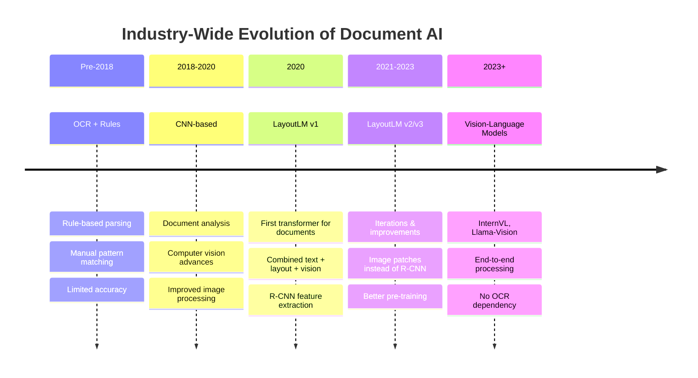

# Document AI Evolution Timeline

```mermaid
timeline
    title Industry-Wide Evolution of Document AI
    
    section Pre-2018
        OCR + Rules : Rule-based parsing
                    : Manual pattern matching
                    : Limited accuracy
    
    section 2018-2020
        CNN-based : Document analysis
                  : Computer vision advances
                  : Improved image processing
    
    section 2020
        LayoutLM v1 : First transformer for documents
                    : Combined text + layout + vision
                    : R-CNN feature extraction
    
    section 2021-2023
        LayoutLM v2/v3 : Iterations & improvements
                       : Image patches instead of R-CNN
                       : Better pre-training
    
    section 2023+
        Vision-Language Models : InternVL, Llama-Vision
                              : End-to-end processing
                              : No OCR dependency
```