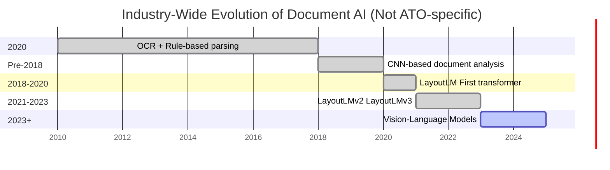
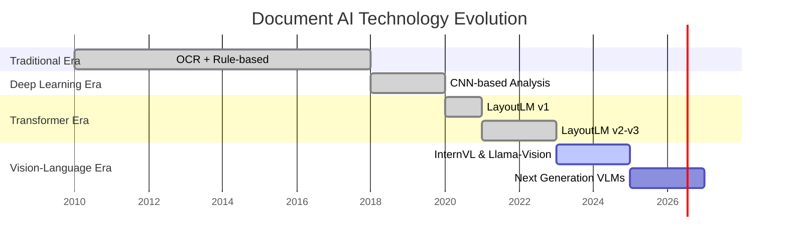
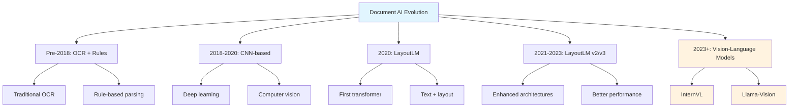

# Document AI Evolution Timeline

## 1. Industry-Wide Evolution of Document AI

```mermaid
gantt
    title Industry-Wide Evolution of Document AI (Not ATO-specific)
    dateFormat  YYYY
    axisFormat  %Y
    
    section Pre-2018
    OCR + Rule-based parsing    :done, pre2018, 2010, 2018
    
    section 2018-2020
    CNN-based document analysis :done, cnn2018, 2018, 2020
    
    section 2020
    LayoutLM First transformer  :done, layoutlm, 2020, 2021
    
    section 2021-2023
    LayoutLMv2 LayoutLMv3      :done, layoutlm23, 2021, 2023
    
    section 2023+
    Vision-Language Models      :active, vlm2023, 2023, 2025
```

## 2. Document AI Technology Evolution

```mermaid
gantt
    title Document AI Technology Evolution
    dateFormat  YYYY
    axisFormat  %Y

    section Traditional Era
    OCR + Rule-based        :done, traditional, 2010, 2018

    section Deep Learning Era
    CNN-based Analysis      :done, cnn, 2018, 2020

    section Transformer Era
    LayoutLM v1            :done, layoutlm1, 2020, 2021
    LayoutLM v2-v3         :done, layoutlm23, 2021, 2023

    section Vision-Language Era
    InternVL & Llama-Vision :active, vlm, 2023, 2025
    Next Generation VLMs    :vlm2, 2025, 2027
```

## 3. Technology Comparison

```mermaid
graph TD
    A[Document AI Evolution] --> B[Pre-2018: OCR + Rules]
    A --> C[2018-2020: CNN-based]
    A --> D[2020: LayoutLM]
    A --> E[2021-2023: LayoutLM v2/v3]
    A --> F[2023+: Vision-Language Models]
    
    B --> B1[Traditional OCR]
    B --> B2[Rule-based parsing]
    
    C --> C1[Deep learning]
    C --> C2[Computer vision]
    
    D --> D1[First transformer]
    D --> D2[Text + layout]
    
    E --> E1[Enhanced architectures]
    E --> E2[Better performance]
    
    F --> F1[InternVL]
    F --> F2[Llama-Vision]
    
    style A fill:#e1f5fe
    style F fill:#fff3e0
    style F1 fill:#fff3e0
    style F2 fill:#fff3e0
```