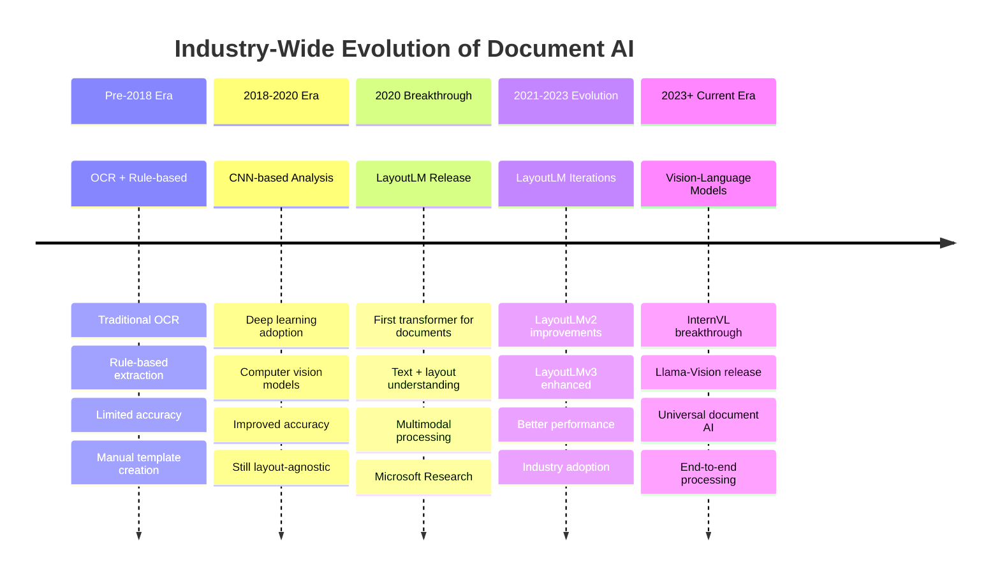
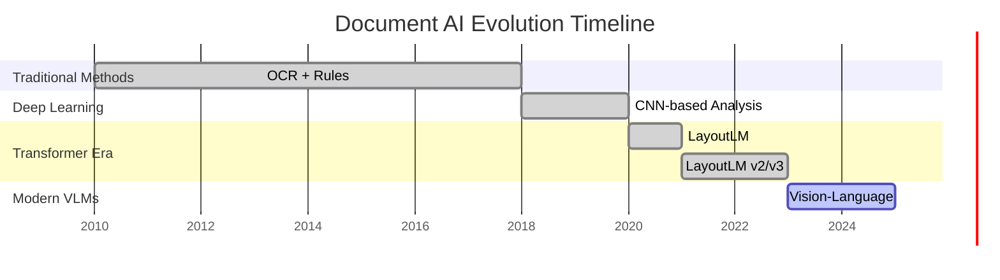

# Document AI Timeline - Mermaid Diagram

## Alternative Gantt Chart View

## Key Milestones

- **Pre-2018**: OCR + Rule-based parsing
- **2018-2020**: CNN-based document analysis  
- **2020**: LayoutLM - First transformer for documents
- **2021-2023**: LayoutLMv2, LayoutLMv3 iterations
- **2023+**: Vision-Language Models (InternVL, Llama-Vision)