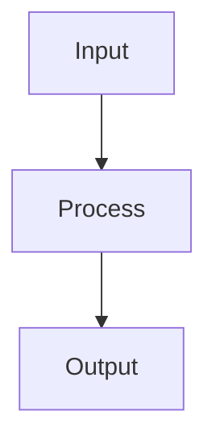

# Hybrid Diagram Approach: Mermaid + Matplotlib

## Overview

This presentation uses a hybrid approach for visualizations:
- **Mermaid**: Architecture diagrams, flowcharts, and conceptual diagrams
- **Matplotlib**: Data visualizations, performance charts, and comparisons

## Benefits of This Approach

### Mermaid for Architecture (Used in Slides)
✅ **Version Control Friendly**: Diagrams as code in markdown
✅ **Editable**: Anyone can modify without Python knowledge
✅ **Integrated**: Renders in GitHub, VS Code, presentation tools
✅ **Maintainable**: Easy to update architecture changes

### Matplotlib for Data (Still Available)
✅ **Data Accuracy**: Precise rendering of performance metrics
✅ **Customization**: Full control over styling and layout
✅ **Publication Quality**: High-resolution outputs
✅ **Complex Visualizations**: Heatmaps, multi-panel figures

## Current Implementation

### Mermaid Diagrams (Embedded in Markdown)
1. **Vision Transformer Architecture** - Shows the ViT pipeline
2. **LayoutLM vs ViT Comparison** - Side-by-side architecture
3. **Self-Attention Mechanism** - Document patch relationships
4. **Document Processing Pipeline** - Traditional vs ViT approach
5. **Migration Strategy** - Phased approach flowchart

### Matplotlib Diagrams (External PNG Files)
1. **project_results.png** - Performance comparison charts
2. **vit_vs_cnn.png** - Visual comparison (can be replaced with Mermaid)
3. **document_processing_comparison.png** - Has emoji issues, better in Mermaid
4. **layoutlm_vs_vit_architecture.png** - Complex layout, kept as PNG

## How to Use

### For Presentations
1. **PowerPoint/Keynote**: 
   - Copy Mermaid code into Mermaid plugin
   - Or use online editor to export as PNG/SVG
   - Keep matplotlib charts as images

2. **Web-based Presentations**:
   - Reveal.js, Marp support Mermaid natively
   - Matplotlib charts as image assets

3. **PDF Export**:
   - Use VS Code with Mermaid extension
   - Export markdown to PDF with rendered diagrams

### For Maintenance
```bash
# Update Mermaid diagrams
# Edit directly in markdown files

# Regenerate matplotlib charts if needed
cd presentation_materials
python generate_vit_diagrams.py
```

## Rendering Mermaid Diagrams

### Option 1: VS Code
1. Install "Markdown Preview Mermaid Support" extension
2. Open markdown file
3. Preview will show rendered diagrams

### Option 2: Online Editor
1. Visit https://mermaid.live/
2. Paste diagram code
3. Export as PNG/SVG

### Option 3: Mermaid CLI
```bash
npm install -g @mermaid-js/mermaid-cli
mmdc -i input.mmd -o output.png
```

### Option 4: GitHub/GitLab
- Automatically renders in markdown files
- No additional setup needed

## Best Practices

1. **Architecture Changes**: Update Mermaid diagrams in markdown
2. **Data Updates**: Regenerate matplotlib charts
3. **New Diagrams**: 
   - Conceptual → Mermaid
   - Data-driven → Matplotlib

## Example: Converting Matplotlib to Mermaid

### Before (Python):
```python
# Complex code to create architecture diagram
fig, ax = plt.subplots(...)
# 50+ lines of matplotlib code
```

### After (Mermaid):


## Conclusion

This hybrid approach provides the best of both worlds:
- Easy maintenance for architecture diagrams
- Professional data visualizations
- Flexibility for different presentation platforms
- Reduced dependencies for basic updates