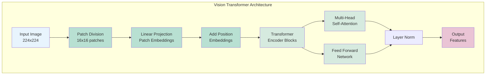
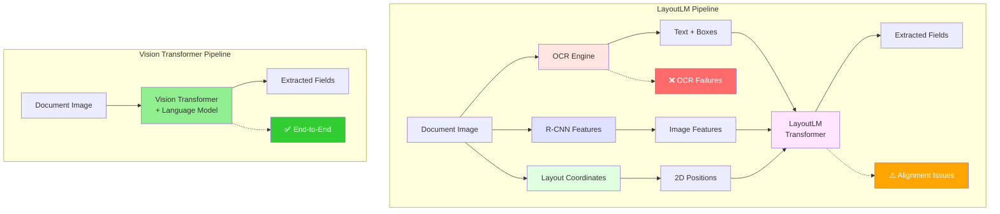
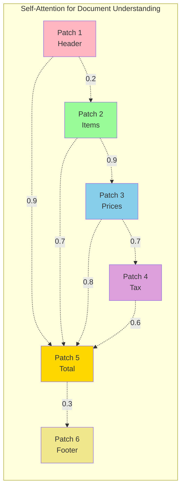
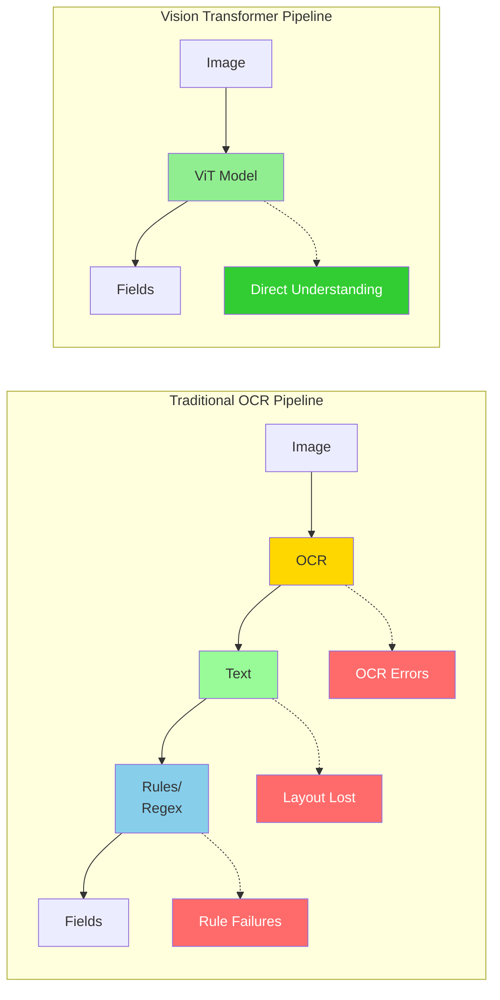
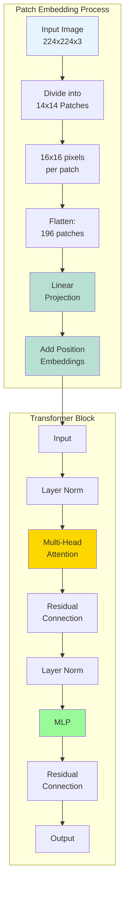
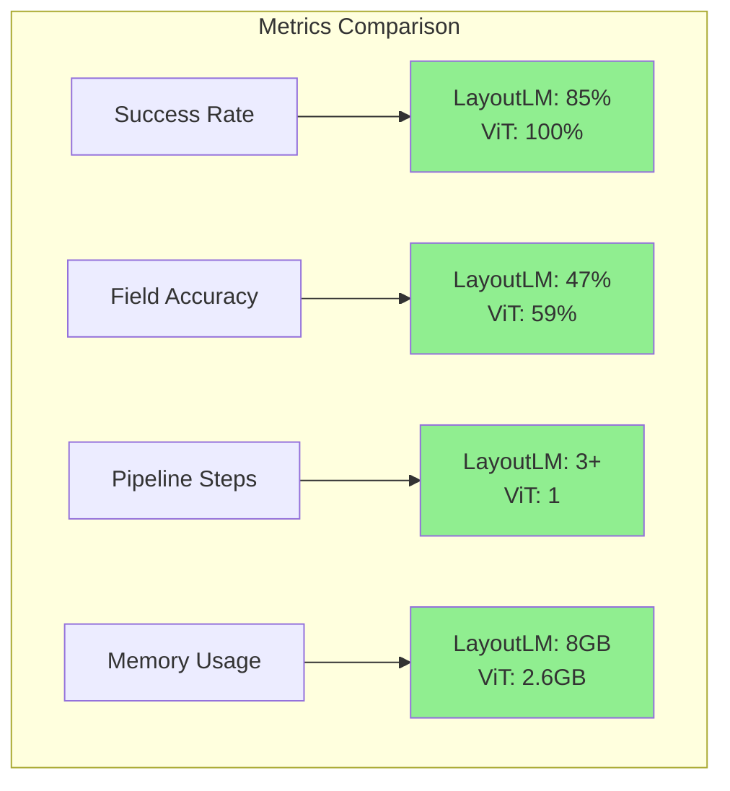
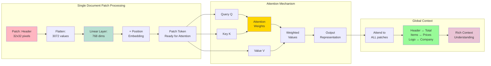
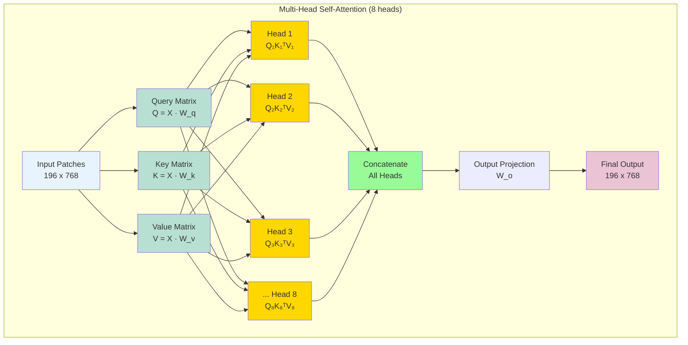
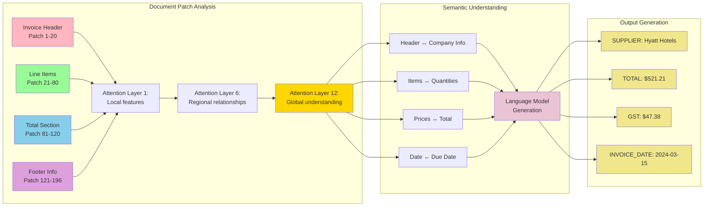

# Mermaid Diagrams for Vision Transformer Presentation

This file contains all the Mermaid diagram definitions for the presentation. These can be embedded directly into markdown files or rendered separately.

## 1. Vision Transformer Architecture



## 2. LayoutLM vs Vision Transformer Comparison



## 3. Self-Attention Mechanism



## 4. Document Processing Pipeline Comparison




## 5. Vision Transformer Components Detail



## 6. Performance Comparison



## 7. Vision Transformer Detailed Pipeline

```mermaid
graph TD
    subgraph "Input Processing"
        A[Document Image<br/>448x448] --> B[Patch Division<br/>32x32 patches]
        B --> C[14x14 patches<br/>each 32x32 pixels]
        C --> D[Flatten to<br/>196 patch vectors]
    end
    
    subgraph "Embedding Layer"
        D --> E[Linear Projection<br/>768-dim embeddings]
        E --> F[Add Positional<br/>Embeddings]
        F --> G[Add [CLS] Token]
    end
    
    subgraph "Transformer Blocks (x12)"
        G --> H[Multi-Head<br/>Self-Attention]
        H --> I[Add & Norm]
        I --> J[Feed Forward<br/>Network]
        J --> K[Add & Norm]
        K --> L[Next Block]
    end
    
    subgraph "Language Model Head"
        L --> M[Vision Encoder<br/>Output]
        M --> N[Language Model<br/>Decoder]
        N --> O[Text Generation<br/>KEY: VALUE]
    end
    
    style A fill:#e8f4fd
    style E fill:#b8e0d2
    style F fill:#b8e0d2
    style H fill:#ffd700
    style J fill:#98fb98
    style N fill:#dda0dd
    style O fill:#eac4d5
```

## 8. Image Patch Processing Detail



## 9. Multi-Head Attention Detail



## 10. Document Understanding Flow



## Usage Notes

### Embedding in Markdown
```markdown
```mermaid
[paste diagram code here]
```
```

### Rendering Options
1. **GitHub/GitLab**: Renders automatically in markdown files
2. **VS Code**: Install Markdown Preview Mermaid Support extension
3. **Presentations**: Many tools (Reveal.js, Marp) support Mermaid
4. **Export**: Use Mermaid CLI or online editor to export as PNG/SVG

### Customization
- Colors can be adjusted in the `style` statements
- Layout direction: TB (top-bottom), LR (left-right), TD (top-down)
- Shapes: Rectangle (default), Round ([]), Diamond {{}}, Circle (())