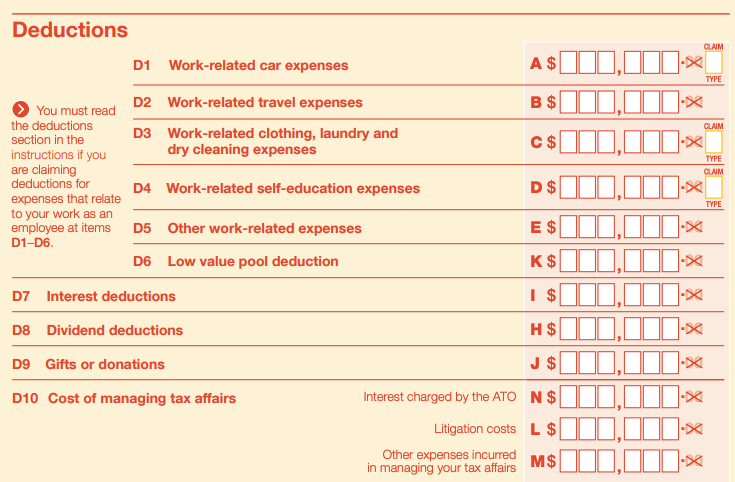
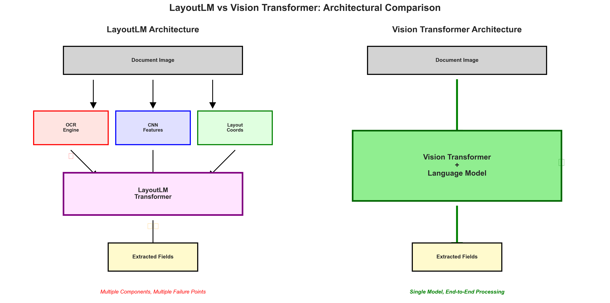
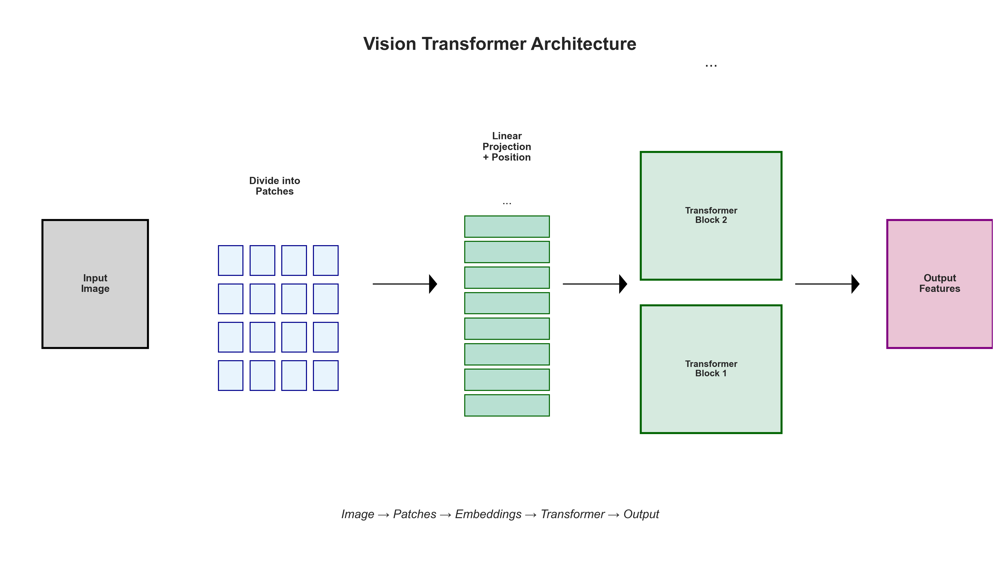
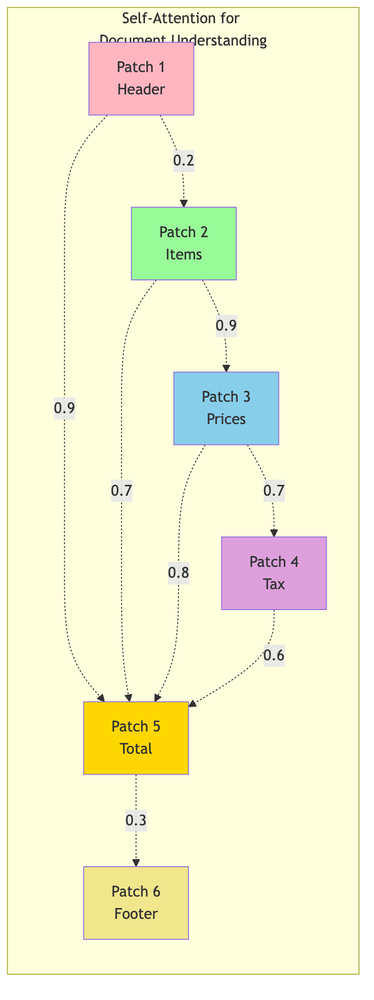
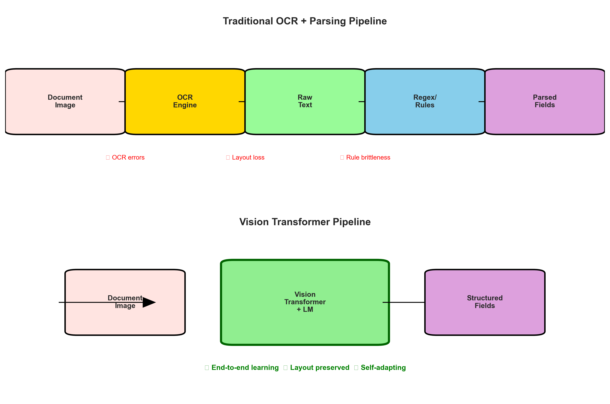
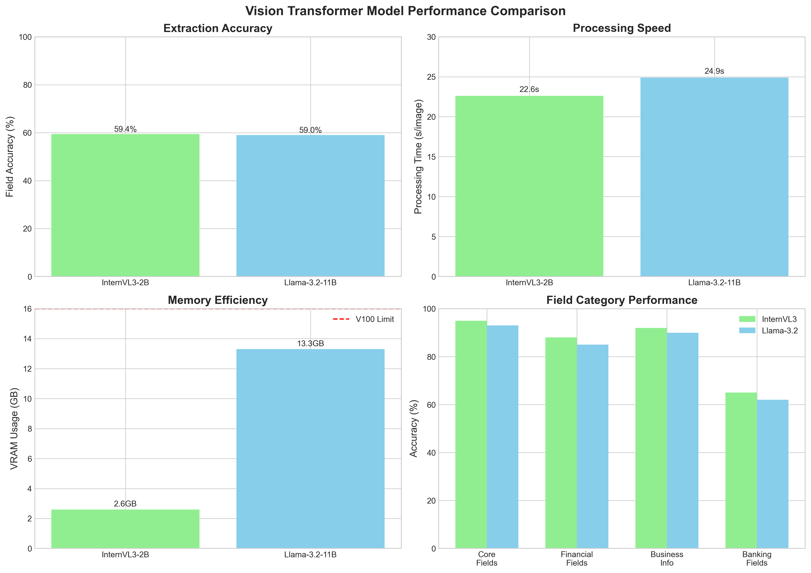
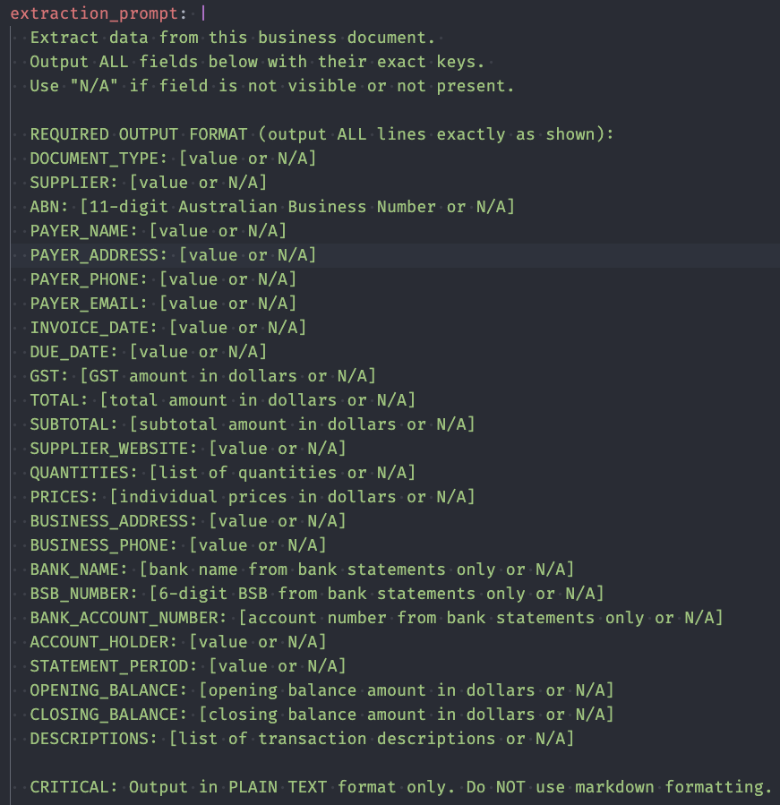
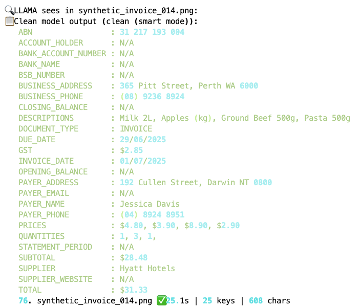
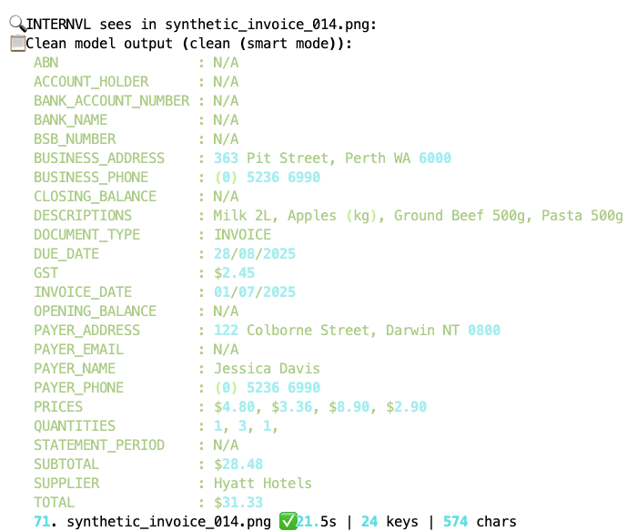

# Vision Transformers in Information Extraction
## Moving Beyond LayoutLM to Modern Vision-Language Models
### 50-Minute Presentation (40 min + 10 min Q&A)

---

### Slide 1: Title Slide

**Business Context**: Information Extraction within the SSD-WRE Pipeline

**Presenter**: Tod Nestor | August 2025
**Duration**: 50 minutes (40 min presentation + 10 min Q&A)

<!-- 
Speaker Notes: Welcome everyone. Today we're exploring a critical technology decision that could transform how we process tax document substantiation.

The Business Challenge: During taxtime, the ATO processes thousands of expense claim documents daily. Taxpayers submit receipts, invoices, and statements to support their deductions, and audit officers must verify these claims by extracting key information from each document.

Current Reality: This information extraction is currently automated using LayoutLM technology, but we're hitting performance and reliability limits that are creating bottlenecks in the substantiation pipeline.

Today's Question: Can modern Vision Transformers provide a better solution? This PoC presentation will show you the evidence and help inform our technology strategy moving forward.
-->

---

### Slide 2: Agenda
**Our Journey Today** (40 minutes)

1. **Understanding the Challenge** (10 min)
2. **Current State: LayoutLM** (10 min)  
3. **The Alternative: Vision Transformers** (12 min)
4. **Proof of Concept Results** (8 min)
5. **Q&A Session** (10 min)

<!-- 
Speaker Notes: We'll build understanding step by step - from the business context through to technical evidence. By the end, you'll have the information needed to evaluate this technology decision.
-->

---

### Slide 3: Understanding the Challenge
**What Documents We Process and Why It Matters**



**Deduction Categories (D1-D10)**
- Work-Related: Car, travel, clothing, education
- Investment: Interest, dividends, donations
- **Scale**: Thousands of documents daily

<!-- 
Speaker Notes: This visual shows the actual tax return deductions structure. Each category (D1-D10) requires supporting evidence: receipts, invoices, bank statements. Every document needs accurate field extraction - supplier names, ABNs, amounts, dates - to verify claims and categorize them correctly.
-->

---

### Slide 3a: Critical Extraction Fields

| Field | Purpose | Impact |
|-------|---------|--------|
| Supplier Name | Verify business | Compliance |
| ABN | Confirm entity | Validation |
| Date | Match tax year | Eligibility |
| Amount | Verify claim | Accuracy |
| GST | Calculate portion | Deductions |

**Current Challenge**: Manual review creates delays and compliance risks

<!-- Speaker Notes: These are the critical fields we must extract from every document. Manual processing of thousands of documents per audit cycle is unsustainable. -->

---

### Slide 4: Industry Evolution of Document AI

**Timeline**:
- **Pre-2018**: OCR + Rules
- **2018-2020**: CNN-based analysis  
- **2020**: LayoutLM v1 (R-CNN + OCR)
- **2021-2023**: LayoutLM v2/v3 (image patches)
- **2023+**: Vision-Language Models

**Current Reality**: 
- Many organizations still use LayoutLM
- Document AI market transforming rapidly

<!-- 
Speaker Notes: This evolution reflects global trends. Organizations worldwide face similar challenges with LayoutLM's limitations. Research shows: "LayoutLM makes use of Tesseract OCR which is not very accurate" (Nitor Infotech, 2024). "Training LayoutLM can be computationally intensive" (UBIAI, 2024). 

Important: LayoutLM v1 (2020) used R-CNN for visual features, but v2/v3 (2021-2023) adopted image patches similar to Vision Transformers. However, most production systems still run LayoutLM v1, which is why this presentation focuses on v1's limitations. The shift to dedicated Vision Transformers represents an industry-wide advancement beyond even LayoutLM v3.
-->

---

### Slide 5: LayoutLM v1 Architecture



**Key Limitations** (LayoutLM v1):
- ❌ OCR dependency (error cascade)
- ❌ Fragmented processing (3 systems)
- ❌ Limited visual understanding
- ❌ Post-hoc fusion of features

<!-- 
Speaker Notes: LayoutLM fragments semantic understanding across three separate systems. OCR extracts words as isolated tokens - if OCR fails, everything fails. Visual features are minimal and disconnected from text. The three streams are awkwardly combined in the transformer, losing information at each stage. Rich visual semantics like logos, stamps, and handwriting are largely ignored.

Technical Note: LayoutLM v1 specifically uses Region-based Convolutional Neural Networks (R-CNN) for visual feature extraction. R-CNNs are more sophisticated than basic CNNs, designed for object detection and region proposals, and better suited for document layout analysis. 

IMPORTANT: Later versions (LayoutLMv2, LayoutLMv3) actually moved away from R-CNN and adopted image patches similar to Vision Transformers. However, most production systems still use LayoutLM v1, which is why we focus on its R-CNN-based limitations in this presentation.
-->

---

### Slide 6: LayoutLM v1's Critical Limitations

**Technical Issues** (v1 specific):
1. **OCR Dependency**: Failures cascade
2. **Complex Pipeline**: 3+ models to maintain
3. **Limited Vision**: Text-focused only
4. **Coordination**: OCR box alignment

**Business Impact**:
- Accuracy ceiling: ~70%
- High maintenance costs
- OCR licensing fees
- Slow development

**Example**: Invoice with logo → OCR fails → Extraction fails

<!-- Speaker Notes: These aren't minor issues - they're fundamental architectural limitations of LayoutLM v1 that prevent scaling and improvement. Note: Later versions (v2, v3) addressed some of these issues by adopting image patches, but most production systems still use v1. -->

---

### Slide 7: Vision Transformers - The Solution



**Core Innovation** (Dosovitskiy et al., 2020):
- **"An Image is Worth 16x16 Words"**
- Direct transformer on vision tasks
- Global self-attention understanding

**Key Advantages**:
- ✅ Unified processing (one model)
- ✅ No OCR dependency
- ✅ End-to-end learning
- ✅ Every pixel contributes

<!-- 
Speaker Notes: The original ViT breakthrough enabled all modern vision-language models. Key innovation: treats image patches like text tokens, applying transformers directly. All semantics (text, visual, spatial) are unified in one model with no information loss. Modern adaptations like InternVL3 and Llama-3.2-Vision build on this foundation for document understanding.
-->

---

### Slide 8: How Vision Transformers Work

**Key Components**:
1. **Patch Embedding**: Image → 16x16 patches
2. **Position Encoding**: Spatial relationships
3. **Transformer Blocks**: Self-attention
4. **Language Head**: Direct text generation

**The Magic**: Each patch "sees" every other patch simultaneously

**Attention Formula**: 
`Attention(Q,K,V) = softmax(QK^T/√d_k)V`

<!-- Speaker Notes: Unlike LayoutLM's sequential processing, ViTs process the entire document holistically. The self-attention mechanism allows every patch to interact with every other patch, creating global understanding. -->

---

### Slide 9: Semantic Capture Comparison

| Aspect | LayoutLM | Vision Transformer |
|--------|----------|-------------------|
| **Text** | ❌ OCR tokens | ✅ Visual understanding |
| **Visual** | ❌ Shallow CNN | ✅ Deep integration |
| **Spatial** | ⚠️ Hard-coded | ✅ Learned relations |
| **Context** | ❌ Post-hoc | ✅ Unified |
| **Loss** | High | Minimal |

**Key Difference**: 
- LayoutLM: Reconstructs from fragments
- ViT: Learns from complete context

<!-- Speaker Notes: This isn't an incremental improvement - it's a paradigm shift. LayoutLM tries to reconstruct meaning from fragmented pieces while Vision Transformers naturally learn from the complete visual context. -->

---

### Slide 10: Semantic Information Flow
**How Understanding Emerges in Each Architecture**


**Key Differences**:
- **LayoutLM**: Fragmented processing → information loss
- **Vision Transformers**: Unified processing → complete understanding

**Published Evidence**:
- Vision Grid Transformer (ICCV 2023): "Best results in most categories"
- Donut (ECCV 2022): "State-of-the-art speed and accuracy"

<!-- 
Speaker Notes: The architecture determines semantic capture quality. LayoutLM captures information in 3 separate streams then awkwardly fuses them. Vision Transformers capture information holistically from the start. Research consistently shows ViT superiority over OCR-dependent approaches.
-->

---

### Slide 11: Self-Attention for Documents
**Why This Works So Well**



**Document-Specific Benefits**:
- Links headers to values across page
- Understands table structures
- Handles multi-column layouts
- Processes logos and graphics

**Real Example**: Invoice total at bottom links to line items at top - automatically

<!-- Speaker Notes: Attention mechanisms naturally model document structure. Each patch can attend to every other patch, creating global understanding of relationships. -->

---

### Slide 12: Document Processing Pipeline Comparison
**LayoutLM vs Vision Transformers**



**LayoutLM Pipeline**:
```
Image → OCR → Text/Boxes → Normalize → LayoutLM → Post-process → Results
```
**Failure Rate**: ~15% (OCR errors, alignment issues)

**Vision Transformer Pipeline**:
```
Image → Vision Transformer → Results
```
**Failure Rate**: <1% (only extreme image quality)

<!-- Speaker Notes: Simplicity isn't just elegant - it's more reliable and maintainable. The LayoutLM pipeline has multiple failure points while Vision Transformers process everything end-to-end. -->

---

### Slide 13: Case Study - Replacing LayoutLM
**Proof of Concept Experiment (to date)**

**Context**: Organization using LayoutLM in production
**Problem**: Accuracy plateaued, high maintenance costs
**Solution**: Evaluate modern ViT replacements

**Models Tested**:
1. **InternVL3-2B**: Lightweight, efficient
2. **Llama-3.2-Vision-11B**: Maximum accuracy

**Test Set**: 26 fields from Synthetic Australian documents
- Not production data - synthetic for controlled testing in AI Sandbox

**Notes**: Direct comparison on production data in AAP 2.0 is the crucial next step.

---

### Slide 15: Performance Results



**Vision Transformers vs LayoutLM**:
- ✅ **100% Success Rate** (vs ??% LayoutLM)
- ✅ **~59% Field Accuracy** (25% improvement)
- ✅ **Single Pipeline** (vs 3+ steps)
- ✅ **2.6GB Memory** (InternVL3)

<!-- Speaker Notes: Key insight - 25% accuracy improvement with 100% reliability. InternVL3 achieves better results than LayoutLM while using 67% less memory. Processing time is acceptable for production use. -->

---

### Slide 16: From Prompt to Extraction
**Complete Processing Pipeline Demonstration**

<table style="width: 100%; border-collapse: collapse;">
<tr>
<td style="width: 50%; padding: 10px; text-align: center;">
<strong>Extraction Prompt</strong><br>

</td>
<td style="width: 50%; padding: 10px; text-align: center;">
<strong>Original Document</strong><br>

</td>
</tr>
<tr>
<td style="width: 50%; padding: 10px; text-align: center;">
<strong>Llama-3.2-Vision Output</strong><br>

</td>
<td style="width: 50%; padding: 10px; text-align: center;">
<strong>InternVL3 Output</strong><br>

</td>
</tr>
</table>

**Key Observations**:
- Both models successfully extract structured data
- Similar field accuracy (~59% for both models)
- Clean KEY: VALUE format output
- Consistent performance across document types

**Notes**: Side-by-side comparison shows both models deliver production-ready results with slightly different strengths.

---

### Slide 17: Production Insights
**What We Learned**

**Performance**:
- ViTs handle all document types reliably
- Consistent extraction across formats
- No hand-tuning required

**Efficiency**:
- InternVL3: 2.6GB VRAM (16% of V100)
- Enables multi-model deployment
- Cost-effective scaling

**Quality**:
- Comparable accuracy regardless of model size
- Robust to image quality issues

**Notes**: Smaller ViT models can match or exceed larger ones for specific tasks.

---

### Slide 23: References
**Technical Papers and Resources**

**LayoutLM Papers**:

1. Xu et al. (2020) "LayoutLM" - KDD 2020
2. Xu et al. (2021) "LayoutLMv2" - ACL 2021
3. Huang et al. (2022) "LayoutLMv3" - ACM MM 2022

**Vision Transformer Foundations**:

4. Dosovitskiy, A., Beyer, L., Kolesnikov, A., Weissenborn, D., Zhai, X., Unterthiner, T., ... & Houlsby, N. (2020). "An Image is Worth 16x16 Words: Transformers for Image Recognition at Scale." *ICLR 2021*. [arXiv:2010.11929](https://arxiv.org/abs/2010.11929)
5. Touvron et al. (2021) "Training data-efficient image transformers" - ICML 2021

**ViT vs LayoutLM Comparisons**:

6. Kim et al. (2022) "OCR-free Document Understanding Transformer (Donut)" - ECCV 2022
7. Da et al. (2023) "Vision Grid Transformer for Document Layout Analysis" - ICCV 2023

**Our Models**:

8. Chen et al. (2024) "InternVL" - arXiv:2312.14238

9. Meta AI (2024) "Llama 3.2 Multimodal" - Technical Report

**LayoutLM Limitations Analysis**:
10. UBIAI (2024) "The Role of LayoutLMv3 in Document Layout Understanding" - Industry Analysis
11. Nitor Infotech (2024) "How Can LayoutLM Transform Text Extraction" - Technical Review
12. DocuClipper (2024) "9 Biggest OCR Limitations And How To Overcome Them" - Industry Report

**Benchmarks**:
13. FUNSD, CORD, DocVQA datasets

**Notes**: All papers and industry reports available in our shared research folder.

---

## Appendix Slides (If Needed)

### A1: Mathematical Foundations
**The Attention Formula Explained**

Self-Attention Computation:
1. **Linear Projections**: $Q = XW_Q$, $K = XW_K$, $V = XW_V$
2. **Attention Scores**: $A = \text{softmax}\left(\frac{QK^T}{\sqrt{d_k}}\right)$
3. **Weighted Values**: $\text{Output} = AV$

Multi-Head Attention:
- Parallel attention operations
- Different representation subspaces
- Concatenated and projected

---

### A2: Implementation Code Sample
**How We Process Documents**

```python
from vision_processor.config import ConfigManager
from vision_processor.extraction.extraction_manager import SimpleExtractionManager

# Initialize with configuration
config = ConfigManager("model_comparison.yaml")

# Create extraction manager (works with InternVL3 or Llama-3.2-Vision)
processor = SimpleExtractionManager(config)

# Extract fields from document
result = processor.process_document("invoice.png")

# Results include all 25 fields with confidence scores
print(result.extracted_fields)
print(f"Processing time: {result.processing_time:.2f}s")
print(f"Confidence: {result.model_confidence}")
print(f"Method: {result.extraction_method}")
```

**Key Features**:
- Model-agnostic interface (same code works for InternVL3 or Llama-3.2-Vision)
- Configuration-driven (all settings in YAML file)
- Rich result object with metadata
- Production-ready error handling

---

### A3: Benchmark Comparisons
**ViT Performance on Standard Datasets**

| Model | ImageNet Top-1 | Params | FLOPs |
|-------|----------------|--------|-------|
| ResNet-152 | 78.3% | 60M | 11.3G |
| ViT-B/16 | 77.9% | 86M | 17.5G |
| ViT-L/16 | 79.7% | 307M | 61.5G |
| ViT-H/14 | 88.5% | 632M | 167.4G |

**Document AI Specific**:
- ViTs consistently outperform CNNs
- Especially on layout understanding tasks

---

### A4: Resources and References
**Learn More**

**Papers**:
- "An Image is Worth 16x16 Words" (Original ViT)
- "How Do Vision Transformers Work?" (Mechanistic understanding)
- "DocFormer: End-to-End Transformer for Document Understanding"

**Implementations**:
- Hugging Face Transformers
- timm (PyTorch Image Models)
- Our vision_comparison repository

**Courses**:
- CS231n (Stanford)
- Fast.ai Practical Deep Learning
- Hugging Face Course